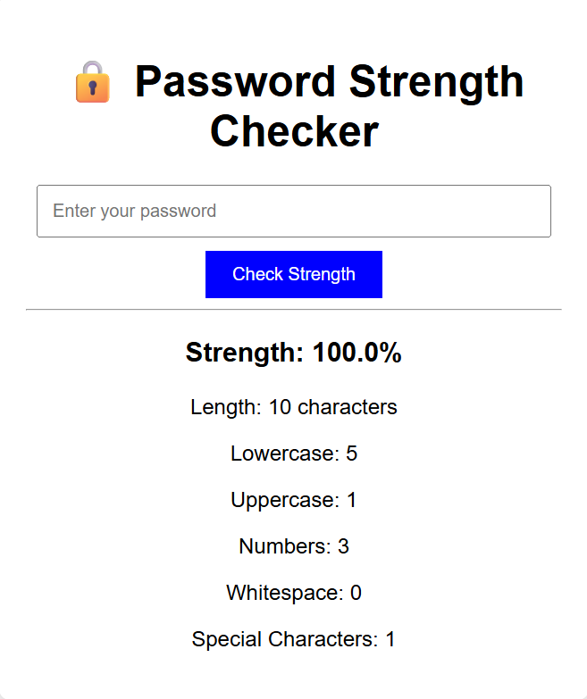

# 🔒 Advanced Password Strength Checker

A Python tool that checks the strength of passwords, detects common weak passwords, and gives suggestions to improve them.  
It also includes a secure password generator for creating strong passwords instantly.

---
## 📷 Screenshots
> Demo UI preview (replace with your own real screenshot later):


---

## 🚀 Features
- ✅ Secure password input (hidden from screen)
- 📊 Strength percentage scoring (0–100%)
- ⚠️ Detects common weak passwords
- 💡 Suggestions for improvement
- 🔐 Random password generator
- 🎨 Color-coded terminal output

---

## 📦 Installation
1. **Clone this repository**  
```bash
git clone https://github.com/YOUR_USERNAME/Password-Strength-Checker.git
cd Password-Strength-Checker
